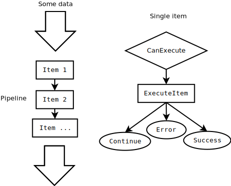

# TaskPipeline

*Task pipeline implementation.*
Simple executable pipeline. Can help you to organize too many tasks in one query.

---

## Implemeted

    [+] Abstractions layer.
    [+] Sequential pipeline.
    [+] Functional predicate.
    [+] Delegate item.

---

## TODO

    [-] Async pipeline item.
    [-] Async pipeline.
    [-] Items undo/redo mechnism.
