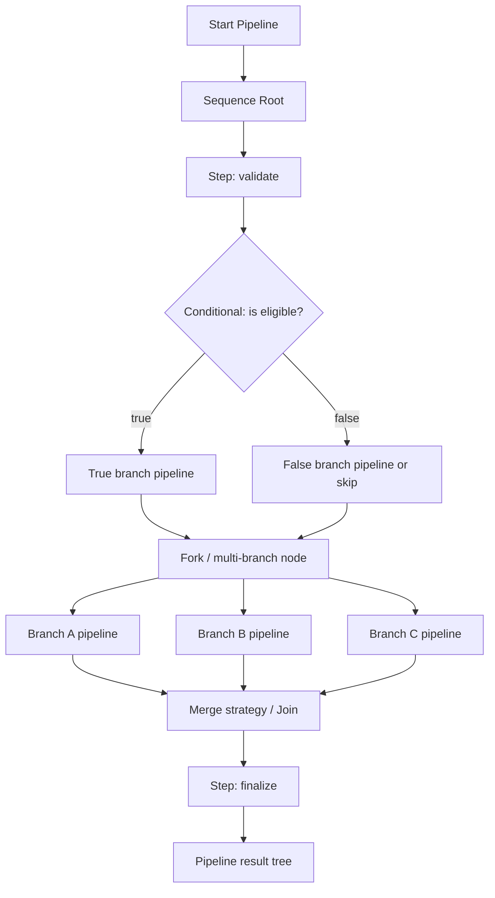

# TaskPipeline

TaskPipeline is a strongly typed, .NET 8+ pipeline orchestration library for sequential work, conditional execution, and multi-branch flows.

It was redesigned around a few practical goals:
- strong typing instead of `object[]`
- async-first execution
- explicit branching and merge points
- deterministic execution results
- real `CancellationToken` propagation
- readable code and testable behavior

## Target platform

TaskPipeline supports **.NET 8 and newer only**.

That means the library intentionally does **not** support:
- .NET Framework
- `netstandard2.1`
- compatibility shims
- legacy API preservation at the cost of architecture quality

## Key concepts

### Pipeline
A pipeline is an executable graph built from nodes.

### Step
A step is a strongly typed unit of work:
- sync or async
- cancellation-aware
- receives a typed context

### Conditional node
A conditional node chooses one branch based on a typed predicate.

### Fork node
A fork node runs several named branches:
- sequentially or in parallel
- with optional per-branch conditions
- with an explicit merge strategy

### Result model
Execution produces a tree of `NodeExecutionResult` instances plus a top-level `PipelineExecutionResult`.

Statuses:
- `Success`
- `Skipped`
- `Failed`
- `Cancelled`

Each result can include:
- duration
- exception
- metadata
- child results

## Installation

```bash
dotnet add package TaskPipeline
```

## Quick start

```csharp
using TaskPipeline;
using TaskPipeline.Abstractions;

var pipeline = PipelineBuilder<OrderContext>
    .Create("order-processing")
    .AddStep("validate", async (ctx, ct) =>
    {
        await ctx.ValidateAsync(ct);
    })
    .AddConditional(
        "check-discount",
        (ctx, _) => ValueTask.FromResult(ctx.Customer.IsVip),
        whenTrue: branch => branch.AddStep("apply-vip-discount", ctx => ctx.ApplyVipDiscount()),
        whenFalse: branch => branch.AddStep("skip-vip-discount", ctx => ctx.Log("Regular pricing")))
    .AddFork(
        "parallel-activities",
        fork => fork
            .AddBranch("reserve-stock", branch =>
                branch.AddStep("reserve-stock-step", async (ctx, ct) => await ctx.ReserveStockAsync(ct)))
            .AddBranch("prepare-shipping", branch =>
                branch.AddStep("prepare-shipping-step", async (ctx, ct) => await ctx.PrepareShipmentAsync(ct))),
        executionMode: BranchExecutionMode.Parallel,
        mergeStrategy: new DelegateMergeStrategy<OrderContext>(
            "publish-summary",
            (ctx, results, ct) => ctx.PublishExecutionSummaryAsync(results, ct)))
    .AddStep("complete", ctx => ctx.MarkCompleted())
    .Build();

var result = await pipeline.ExecuteAsync(new OrderContext(), cancellationToken);
```

## How execution works

### Sequential flow
Nodes inside a sequence run in declaration order.

### Conditional flow
A conditional node evaluates its condition and chooses:
- `whenTrue`
- `whenFalse`
- or `Skipped` if `whenFalse` is absent

### Fork flow
A fork node executes branch pipelines:
- `Sequential` preserves simple ordered branching
- `Parallel` starts all branches concurrently

Even in parallel mode, branch results are returned in **declaration order** so diagnostics remain deterministic.

### Merge / join
After branches complete, the merge strategy runs only when the fork ends with:
- `Success`
- `Skipped`

It does **not** run when the fork is `Failed` or `Cancelled`.

## Pipeline diagram



## Diagram explanation

### 1. Sequence root
This is the main ordered flow of the pipeline. Every `AddStep`, `AddConditional`, and `AddFork` becomes a child node of the sequence root.

### 2. Conditional node
A condition chooses exactly one branch:
- true branch
- false branch
- or skip when no false branch exists

The selected path is stored in result metadata.

### 3. Fork node
A fork represents a real branching point. Each branch is itself a small pipeline.

A branch may:
- run normally
- be skipped by its own condition
- fail independently
- be cancelled through the shared token

### 4. Merge strategy
The merge strategy is the explicit join point after branches complete. This keeps aggregation logic out of steps and makes post-branch behavior intentional and testable.

### 5. Result tree
`PipelineExecutionResult.Root` is the full execution tree.

This is useful for:
- diagnostics
- logs
- visualization
- failure analysis
- deterministic testing

## Failure semantics

Two failure modes are supported.

### FailFast
Execution stops after the first failed node in the current sequence or sequential fork.

### ContinueOnError
Execution continues, but the overall pipeline status still becomes `Failed` if any node fails.

## Cancellation semantics

Cancellation is part of the execution model, not an afterthought.

What happens:
- cancellation before start returns `Cancelled`
- cancellation inside a step returns `Cancelled`
- cancellation in parallel branches propagates to the fork and then to the pipeline
- merge does not run after cancellation

### Important detail about `CancelledNodes` and `FailedNodes`

`PipelineExecutionResult` exposes convenience collections:
- `FailedNodes`
- `CancelledNodes`

These collections return **terminal actionable nodes**, not every aggregate wrapper.

For example, if a single step fails, the pipeline root and the wrapping sequence may also have status `Failed`, but `FailedNodes` will contain the actual failed step node instead of duplicating aggregate containers.

If you need the full aggregated view, inspect `PipelineExecutionResult.Root` directly.

## Branching example

```csharp
var pipeline = PipelineBuilder<BuildContext>
    .Create("build")
    .AddStep("restore", async (ctx, ct) => await ctx.RestoreAsync(ct))
    .AddFork(
        "test-matrix",
        fork => fork
            .AddBranch("unit-tests", branch =>
                branch.AddStep("run-unit-tests", async (ctx, ct) => await ctx.RunUnitTestsAsync(ct)))
            .AddBranch("integration-tests", branch =>
                branch.AddStep("run-integration-tests", async (ctx, ct) => await ctx.RunIntegrationTestsAsync(ct)))
            .AddBranch(
                "security-scan",
                (ctx, _) => ValueTask.FromResult(ctx.ShouldRunSecurityScan),
                branch => branch.AddStep("run-security-scan", async (ctx, ct) => await ctx.RunSecurityScanAsync(ct))),
        executionMode: BranchExecutionMode.Parallel,
        mergeStrategy: new DelegateMergeStrategy<BuildContext>(
            "collect-artifacts",
            async (ctx, results, ct) => await ctx.CollectArtifactsAsync(results, ct)))
    .AddStep("publish", async (ctx, ct) => await ctx.PublishAsync(ct))
    .Build();
```

## Behaviors

Behaviors wrap node execution and can enrich metadata or diagnostics.

Typical uses:
- timing
- structured diagnostics
- tracing
- correlation IDs
- custom logging bridges

## Running tests

```bash
dotnet restore
dotnet build
dotnet test
```

## Project layout

```text
src/
  TaskPipeline.Abstractions/
  TaskPipeline/

tests/
  TaskPipeline.Tests/
```

## Design notes

This library intentionally prefers:
- explicit orchestration over magic callbacks
- typed contracts over weak runtime casting
- deterministic result trees over opaque status flags
- composition over inheritance-heavy frameworks

That makes it suitable as a foundation for production code, diagnostics-heavy workflows, and future extension.
